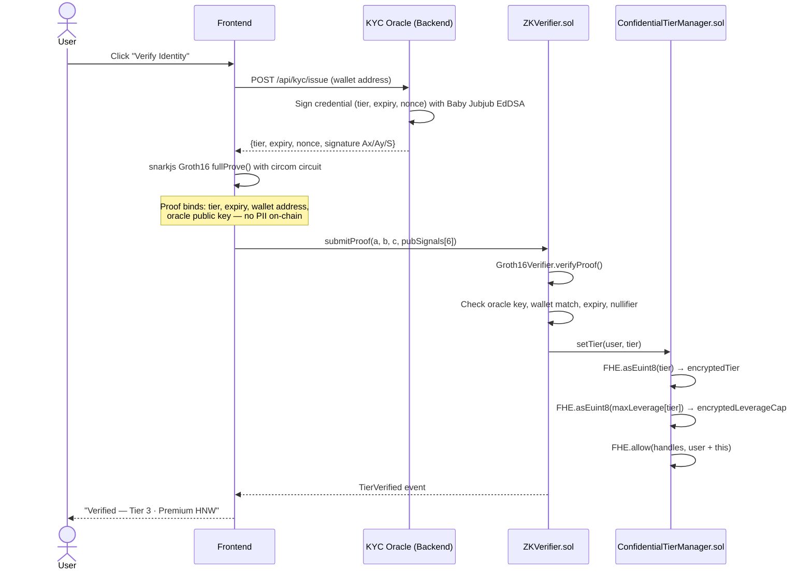
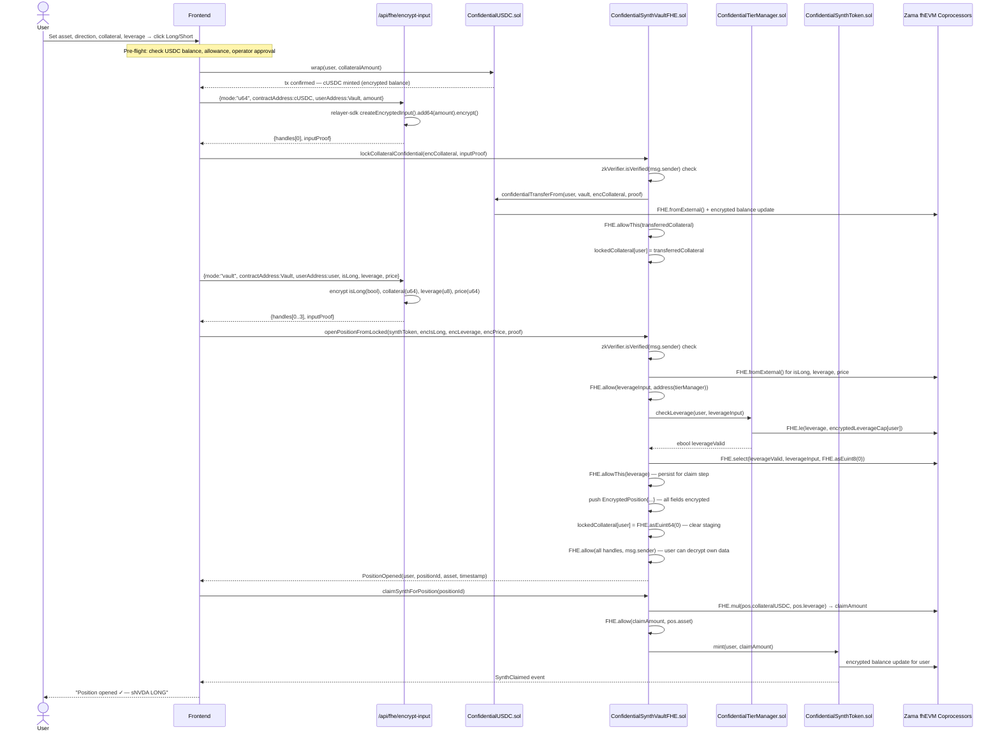
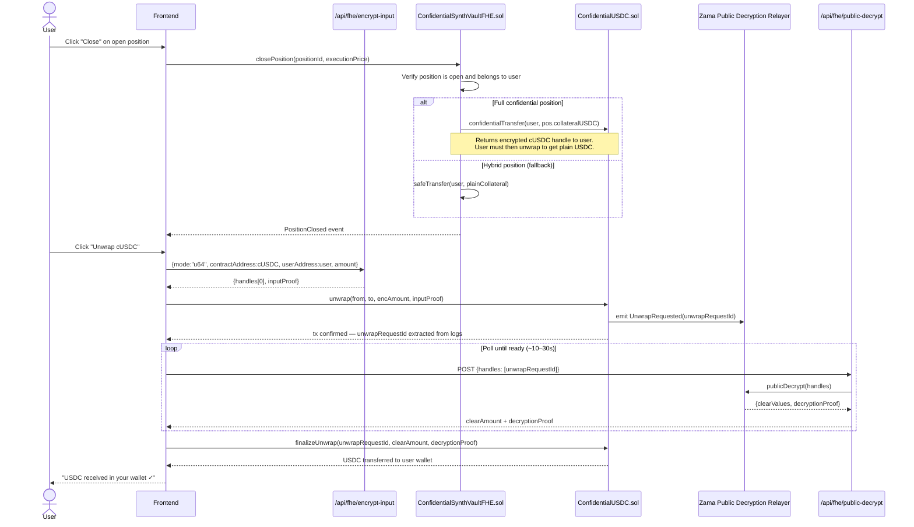

# Ztocks — Confidential Synthetic Stock Trading on Zama fhEVM

> **The first leveraged synthetic stock protocol where collateral, leverage, direction, and position size are fully encrypted on-chain — while compliance rules are enforced directly on ciphertext using Fully Homomorphic Encryption.**

---

## The Problem in One Sentence

On every public blockchain today, your entire trading strategy is visible to anyone watching — enabling $1.3B+ in MEV extraction and blocking institutional adoption that could unlock trillions in DeFi liquidity.

---

## Why This Matters — Market Context

| Metric | Value | Source |
|---|---|---|
| DeFi market size (2026) | **$238.54B** → projected **$770.56B by 2031** (26.43% CAGR) | [Mordor Intelligence](https://www.mordorintelligence.com/industry-reports/decentralized-finance-defi-market) |
| DeFi TVL Q1 2026 | **$185B** (+23% from late 2025) | [Resh Network](https://www.resh.network/blog/defi-state-of-market-2026) |
| Active DeFi users Q1 2026 | **8.2M** (+45% YoY) | [Resh Network](https://www.resh.network/blog/defi-state-of-market-2026) |
| Institutional share of TVL | **34%** | [Resh Network](https://www.resh.network/blog/defi-state-of-market-2026) |
| Institutional adoption rate | **~40%** — flat despite regulatory progress | [Retail Banker International](https://www.retailbankerinternational.com/news/institutional-crypto-adoption-flat-in-2025-globaldata/) |
| Ethereum MEV losses | **$1.3B+** in front-running, sandwiching, liquidation targeting | [Digitap](https://digitap.app/news/guide/what-is-mev-how-it-impacts-traders-networks-in-2025) |

**The gap is structural.** Forbes (Apr 2026): *"Public blockchains' radical transparency bootstrapped early DeFi trust but now creates execution risks and security threats for institutions."* [Forbes](https://www.forbes.com/sites/digital-assets/2026/04/02/the-privacy-paradox-in-on-chain-finance/)

**The real-world cost:** James Wynn's $1.25B BTC long at 40x leverage on Hyperliquid was entirely public. Adversaries read his liquidation threshold from the chain, constructed inverse positions, and netted **$17 million** by systematically triggering his liquidation. This is the existing architecture working as designed. [Source](https://a1research.io/blog/private-onchain-trading-the-privacy-paradox-in-blockchain)

---

## Three Layers of the Problem

### 1. Every Trade Is Public
On any current DeFi protocol, every pending and open position exposes:
- Collateral amount → attackers know your exact liquidation price
- Leverage multiplier → bots construct inverse positions to trigger you
- Trade direction → competitors front-run your entry
- Full wallet history → your entire trading book is reconstructable

### 2. MEV Is a Silent Tax
Public mempool parameters make every trade a target:
- **Front-running:** bots submit higher-gas copies of your tx before you
- **Sandwich attacks:** buy before you, sell after you, extract slippage
- **Liquidation sniping:** bots monitor public health factors and race to liquidate first
- On volatile leveraged synthetics, this invisible tax reaches **1–5% per transaction**

### 3. Institutions Won't Participate Without Privacy
*"A hedge fund cannot move $50M into a DeFi protocol if every competitor can see their position, size, entry price, and liquidation level in real time."*

76% of global investors planned to expand digital asset exposure in 2025/2026, yet institutional adoption has remained flat. The cited reason across multiple surveys: **data privacy and commercial confidentiality**. [B2Broker Research](https://b2broker.com/news/institutional-adoption-of-crypto/)

---

## The Solution — Ztocks × Zama FHE

Ztocks uses **Fully Homomorphic Encryption** to keep the entire trade lifecycle encrypted — from the moment you submit a transaction to the moment you close.

```
Without FHE (today's DeFi):
  collateral = 10,000 USDC    ← visible to bots
  leverage   = 8x             ← visible to bots
  direction  = LONG sNVDA     ← visible to bots
  → MEV bots extract value from your trade

With Ztocks × Zama FHE:
  collateral = euint64(encrypted)  ← hidden from everyone
  leverage   = euint8(encrypted)   ← hidden from everyone
  direction  = ebool(encrypted)    ← hidden from everyone
  → Smart contract enforces compliance rules ON ciphertext
  → Nobody — not validators, not operators — ever sees your position
```

The compliance rule (leverage ≤ tier cap) is enforced by the contract using `FHE.le()` — without the contract or anyone else ever seeing either value in plaintext. This is stronger than ZK proofs: ZK proves a fact about private data; FHE computes results from private data.

---

## What Makes Ztocks Unique

| Protocol | Trade Privacy | MEV Protection | Compliance | FHE | Leveraged Synths |
|---|---|---|---|---|---|
| Synthetix | ❌ All public | ❌ Fully exposed | ❌ | ❌ | ✅ |
| Mirror Protocol | ❌ All public | ❌ | ❌ | ❌ | ✅ |
| Railgun | ✅ ZK shielded | ✅ Partial | ❌ | ❌ | ❌ |
| Secret Network | ✅ TEE-based | ✅ | ❌ | ❌ | ❌ |
| ZamaSwap (reference) | ✅ FHE | ✅ Full | ❌ No tiers | ✅ | ❌ |
| **Ztocks** | **✅ FHE full** | **✅ MEV-proof** | **✅ Tier-gated** | **✅** | **✅** |

**Three capabilities no other protocol combines:**
1. **Encrypted leverage enforcement** — `FHE.le(requestedLeverage, encryptedTierCap)` enforces the compliance rule without seeing either value
2. **FHE + compliance together** — existing FHE demos have no identity layer; existing compliant DeFi has no privacy. Ztocks has both.
3. **MEV-proof synthetic equities** — position parameters are encrypted from first submission, invisible to any mempool observer

---

## Technical Architecture

### System Overview

```
┌──────────────────────── User / Browser ──────────────────────────┐
│  Next.js 16 frontend (React 19, wagmi, RainbowKit, viem)         │
│                                                                   │
│  fhevmjs  ── encrypts trade inputs (collateral, leverage,        │
│              direction) client-side before sending to chain       │
│                                                                   │
│  snarkjs + circom  ── generates Groth16 ZK proof for KYC tier    │
│                       attestation locally in the browser          │
│                                                                   │
│  Zama Relayer SDK  ── server-side API routes for encrypted        │
│                       input generation and public decryption      │
└───────────────────────────────────┬──────────────────────────────┘
                                    │
                            encrypted inputs
                          + ZK proof bundle
                                    │
                                    ▼
┌──────────────────────── Sepolia / fhEVM ─────────────────────────┐
│                                                                   │
│  ZKVerifier.sol                                                   │
│  ├─ Verifies Groth16 proof on-chain (Groth16Verifier.sol)        │
│  ├─ Validates oracle Baby Jubjub signature                        │
│  ├─ Anti-replay via nullifier set                                 │
│  └─ Calls TierManager.setTier() → stores encrypted tier + cap    │
│                                                                   │
│  ConfidentialTierManager.sol                                      │
│  ├─ Stores encrypted tier per wallet (euint8)                     │
│  ├─ Precomputes encrypted leverage cap at tier-set time           │
│  └─ checkLeverage() → single FHE.le() O(1) comparison            │
│                                                                   │
│  ConfidentialSynthVaultFHE.sol (CORE)                             │
│  ├─ lockCollateralConfidential() → ERC-7984 confidentialTransfer  │
│  ├─ openPositionFromLocked() → FHE leverage check + position      │
│  ├─ claimSynthForPosition() → FHE.mul(collateral, leverage) mint  │
│  ├─ closePosition() → refund flow                                 │
│  └─ All position fields encrypted: isLong, collateral, leverage,  │
│     entryPrice, synthAmount                                       │
│                                                                   │
│  ConfidentialUSDC.sol (ERC-7984 wrapper)                         │
│  └─ wrap() / confidentialTransferFrom() / unwrap()               │
│                                                                   │
│  ConfidentialSynthToken.sol × 9 (ERC-7984 per asset)             │
│  └─ mint() / burn() — encrypted balances per synth               │
│                                                                   │
└───────────────────────────────────┬──────────────────────────────┘
                                    │
                              FHE coprocessors
                          (Zama fhEVM on Sepolia)
                                    │
                                    ▼
┌──────────────────────── Zama Protocol Layer ─────────────────────┐
│  fhEVM coprocessors execute FHE arithmetic off-chain              │
│  Results posted back on-chain as encrypted handles                │
│  ACL (Access Control List) governs which contracts/users can      │
│  decrypt or operate on each encrypted handle                      │
│  Public decryption gateway for unwrap finalization                │
└──────────────────────────────────────────────────────────────────┘
```

---

## How Zama's Features Are Used

### 1. Encrypted Types (`euint64`, `euint8`, `ebool`)

All position data is stored as encrypted handle types from `@fhevm/solidity`:

```solidity
struct EncryptedPosition {
    address asset;           // plaintext — not sensitive
    ebool   isLong;          // ENCRYPTED — direction hidden from mempool
    euint64 collateralUSDC;  // ENCRYPTED — collateral amount hidden
    euint8  leverage;        // ENCRYPTED — leverage multiplier hidden
    euint64 entryPrice;      // ENCRYPTED — entry price hidden
    euint64 synthAmount;     // ENCRYPTED — position size hidden
    uint256 openTime;        // plaintext — timestamp not sensitive
    bool    isOpen;          // plaintext — needed for iteration
}
```

### 2. FHE Arithmetic Operations

**Leverage cap enforcement** — the compliance rule enforced without plaintext:
```solidity
// In ConfidentialTierManager.checkLeverage()
ebool leverageValid = FHE.le(requestedLeverage, encryptedLeverageCap[user]);
```

**Position sizing** — multiplication on encrypted operands in `claimSynthForPosition()`:
```solidity
euint64 claimAmount = FHE.mul(pos.collateralUSDC, pos.leverage);
```

**Encrypted select** — clamp invalid leverage to zero without revealing the comparison result:
```solidity
euint8 leverage = FHE.select(leverageValid, leverageInput, FHE.asEuint8(0));
```

### 3. FHE Access Control List (ACL)

Every encrypted handle requires explicit ACL grants before another contract or account can operate on it. Without this, cross-contract FHE operations revert silently.

```solidity
// Grant TierManager permission to run FHE.le() on the leverage input handle
FHE.allow(leverageInput, address(tierManager));

// Preserve vault's own access to leverage handle for later claim arithmetic
FHE.allowThis(leverage);

// Grant synth token contract access to consume the mint amount handle
FHE.allow(claimAmount, pos.asset);

// Grant user permission to decrypt their own position fields
FHE.allow(isLong, msg.sender);
FHE.allow(collateralUSDC, msg.sender);
```

### 4. ERC-7984 Confidential Token Standard

Both `ConfidentialUSDC` and `ConfidentialSynthToken` inherit from OpenZeppelin's `ERC7984ERC20Wrapper`:

- `wrap(address to, uint256 amount)` — converts plaintext USDC to encrypted cUSDC
- `confidentialTransferFrom(from, to, externalEuint64, inputProof)` — encrypted transfer with proof
- `unwrap(from, to, encAmount, inputProof)` + `finalizeUnwrap()` — two-step unwrap via Zama relayer public decryption

### 5. `FHE.fromExternal()` — Input Proof Validation

All client-side encrypted inputs go through proof validation before the contract accepts them:

```solidity
// In openPositionFromLocked() — verifies client-encrypted inputs are bound
// to the correct contract/user context, preventing replay attacks
ebool isLong = FHE.fromExternal(encIsLong, inputProof);
euint8 leverageInput = FHE.fromExternal(encLeverage, inputProof);
euint64 executionPrice = FHE.fromExternal(encExecutionPrice, inputProof);
```

### 6. `ZamaEthereumConfig` — Sepolia fhEVM Configuration

All contracts inherit `ZamaEthereumConfig` which wires them to Zama's Sepolia gateway, ACL contract, and FHE coprocessor endpoints automatically.

### 7. `@zama-fhe/relayer-sdk` — Server-Side Encryption

A Next.js API route (`/api/fhe/encrypt-input`) uses `@zama-fhe/relayer-sdk/node` to build encrypted input bundles (handles + proof) on the server, avoiding WASM loading complexity in the browser for multi-input proofs:

```typescript
const instance = await createInstance({ ...SepoliaConfig, network });
const input = instance.createEncryptedInput(contractAddress, userAddress);
input.addBool(isLong);
input.add64(collateral);
input.add8(leverage);
input.add64(executionPrice);
const encrypted = await input.encrypt();
```

---

## Full Trade Flow — Sequence Diagrams

### Identity Verification (ZK Proof)



### Confidential Position Open (Full FHE Flow)



### Position Close + USDC Unwrap



---

## ZK Circuit — KYC Tier Proof

Located in `circuits/tier_proof.circom`. The circuit proves:

- User holds a valid credential signed by the trusted oracle
- The credential binds: `tier`, `expiry`, `walletAddress`, `oraclePubKey`
- `expiry > block.timestamp` (checked on-chain post-proof)
- No personal data (name, ID, etc.) appears in any public signal

**Public signals (6):**

| Index | Name | Description |
|---|---|---|
| 0 | nullifier | Prevents proof replay |
| 1 | tier | KYC tier (1–4) |
| 2 | expiry | Unix timestamp of credential expiry |
| 3 | walletAddress | Proves proof is for calling wallet |
| 4 | oracleAx | Oracle Baby Jubjub public key X |
| 5 | oracleAy | Oracle Baby Jubjub public key Y |

**KYC Tier Policy:**

| Tier | Label | Max Leverage | Description |
|---|---|---|---|
| 1 | Basic KYC | 2x | Standard identity verification |
| 2 | Accredited Investor | 5x | Meets accreditation requirements |
| 3 | Premium HNW | 8x | High net worth individual |
| 4 | Institutional / QIB | 10x | Qualified institutional buyer |

---

## Deployed Contracts — Sepolia Testnet

> Last deployed: 2026-05-08 · Deployer: `0x2c32743B801B9c3d53099334e2ac5a8DA39498bC`

### Core Infrastructure

| Contract | Address |
|---|---|
| Underlying USDC | [`0x1c7D4B196Cb0C7B01d743Fbc6116a902379C7238`](https://sepolia.etherscan.io/address/0x1c7D4B196Cb0C7B01d743Fbc6116a902379C7238) |
| ConfidentialUSDC (cUSDC) | [`0xfDBFC62F97A7988515a2684fA427d449fA7a6BAe`](https://sepolia.etherscan.io/address/0xfDBFC62F97A7988515a2684fA427d449fA7a6BAe) |
| ZKVerifier | [`0xE1936D15f2F4dE2e5599d211EA13B6b791F65E84`](https://sepolia.etherscan.io/address/0xE1936D15f2F4dE2e5599d211EA13B6b791F65E84) |
| ConfidentialTierManager | [`0x54f249A9E93b38f6113bF20d8943B95251E39D08`](https://sepolia.etherscan.io/address/0x54f249A9E93b38f6113bF20d8943B95251E39D08) |
| ConfidentialSynthVaultFHE | [`0x48FF2EbcC730a1A6D38b4562c4F83196CEFe2940`](https://sepolia.etherscan.io/address/0x48FF2EbcC730a1A6D38b4562c4F83196CEFe2940) |

### Confidential Synthetic Tokens (ERC-7984)

| Symbol | Underlying | Address |
|---|---|---|
| csAAPL | Apple Inc. | [`0x23BB53D8B6704Cd1d4deE9ee21a6E5268eF2822b`](https://sepolia.etherscan.io/address/0x23BB53D8B6704Cd1d4deE9ee21a6E5268eF2822b) |
| csTSLA | Tesla Inc. | [`0xb4A3C39f28F93591FB9F0cAB91dB1a55dA2ee021`](https://sepolia.etherscan.io/address/0xb4A3C39f28F93591FB9F0cAB91dB1a55dA2ee021) |
| csNVDA | NVIDIA Corp. | [`0xbceaE25027249925c4D60E4Ca9B6bc6286C4Bf3E`](https://sepolia.etherscan.io/address/0xbceaE25027249925c4D60E4Ca9B6bc6286C4Bf3E) |
| csSPY | S&P 500 ETF | [`0xE9bf94D03Be0825602E0574A184Cae9b3105196e`](https://sepolia.etherscan.io/address/0xE9bf94D03Be0825602E0574A184Cae9b3105196e) |
| csAMZN | Amazon.com Inc. | [`0x401C67dfFdB067Da490dB7c6d74A76F35Bc72877`](https://sepolia.etherscan.io/address/0x401C67dfFdB067Da490dB7c6d74A76F35Bc72877) |
| csMSFT | Microsoft Corp. | [`0x6fad7D2A098bB7FF15eb115B39926Ad4873E193C`](https://sepolia.etherscan.io/address/0x6fad7D2A098bB7FF15eb115B39926Ad4873E193C) |
| csMETA | Meta Platforms | [`0xcaacC7Ff819239c1A803152ff3A08FAfdca2d149`](https://sepolia.etherscan.io/address/0xcaacC7Ff819239c1A803152ff3A08FAfdca2d149) |
| csNFLX | Netflix Inc. | [`0x75Bb1459aEd9DF8633E02a75022Fb7695d933301`](https://sepolia.etherscan.io/address/0x75Bb1459aEd9DF8633E02a75022Fb7695d933301) |
| csAMD | Advanced Micro Devices | [`0xd4a2b44a2fBa1ed1Dc17E28161699C57CF15799C`](https://sepolia.etherscan.io/address/0xd4a2b44a2fBa1ed1Dc17E28161699C57CF15799C) |

---

## Repository Structure

```
Ztocks/
├── contracts/                  # Hardhat project — all Solidity
│   ├── contracts/
│   │   ├── ConfidentialSynthVaultFHE.sol    # Core vault — FHE encrypted positions
│   │   ├── ConfidentialTierManager.sol      # Encrypted tier storage + leverage checks
│   │   ├── ConfidentialUSDC.sol             # ERC-7984 confidential USDC wrapper
│   │   ├── ConfidentialSynthToken.sol       # ERC-7984 confidential synth token
│   │   ├── ZKVerifier.sol                   # Groth16 proof verification + tier write
│   │   └── Groth16Verifier.sol              # Generated from circom circuit
│   ├── scripts/
│   │   ├── deploy.ts                        # Full deployment script
│   │   └── wire-contracts.ts                # Post-deploy permission wiring
│   └── deployments/sepolia.json             # Live contract addresses
│
├── circuits/                   # Circom ZK circuit
│   ├── tier_proof.circom        # KYC tier attestation circuit
│   └── scripts/setup.ps1        # Compile + trusted setup + artifact export
│
├── frontend/                   # Next.js 16 dApp
│   ├── app/
│   │   ├── trade/page.tsx       # Trading interface
│   │   ├── portfolio/page.tsx   # Positions + P&L display
│   │   ├── sip/page.tsx         # SIP investment flow
│   │   └── api/fhe/             # Server-side FHE API routes
│   │       ├── encrypt-input/route.ts    # Build encrypted input bundles
│   │       ├── public-decrypt/route.ts  # Proxy Zama relayer public decryption
│   │       └── user-decrypt/route.ts    # Orchestrate EIP-712 user decryption
│   ├── components/              # UI components
│   ├── hooks/
│   │   ├── use-vault.ts         # Core trading hook — all tx logic
│   │   └── use-zk-identity.ts   # ZK proof generation + tier management
│   ├── lib/
│   │   ├── fhe.ts               # FHE encryption helpers + retry logic
│   │   ├── abis.ts              # Contract ABIs
│   │   ├── contracts.ts         # Address configuration
│   │   └── sepolia-defaults.json
│   └── public/
│       ├── circuits/            # tier_proof.wasm + .zkey (browser proof gen)
│       └── tfhe_bg.wasm         # Zama TFHE WASM for browser FHE init
│
└── backend/                    # Express.js oracle + price feed
    ├── src/
    │   ├── kyc/                 # KYC credential issuance (Baby Jubjub EdDSA)
    │   └── price/               # Market data proxy (Finnhub)
    └── .env.example
```

---

## Tech Stack

| Layer | Technology |
|---|---|
| Smart contracts | Solidity 0.8.24, Hardhat |
| FHE library | `@fhevm/solidity` (Zama) |
| Confidential tokens | `@openzeppelin/confidential-contracts` ERC-7984 |
| ZK proofs | Circom 2, snarkjs (Groth16), Baby Jubjub EdDSA |
| Frontend | Next.js 16, React 19, TypeScript |
| Web3 | wagmi v2, viem v2, RainbowKit |
| FHE browser SDK | `fhevmjs`, `@zama-fhe/relayer-sdk` |
| Backend | Express.js, TypeScript |
| Market data | Finnhub API |
| Testnet | Ethereum Sepolia + Zama fhEVM coprocessors |

---

## Local Setup

### Prerequisites

- Node.js 20+
- MetaMask configured for Sepolia testnet
- Sepolia ETH (from a faucet) + Sepolia USDC (Circle testnet faucet)

### Install

```bash
cd contracts && npm install
cd ../frontend && npm install
cd ../backend && npm install
cd ../circuits && npm install   # only needed if regenerating proofs
```

### Environment

**`contracts/.env`**
```env
SEPOLIA_RPC_URL=https://eth-sepolia.g.alchemy.com/v2/YOUR_KEY
PRIVATE_KEY=your_deployer_private_key
ORACLE_PUBKEY_AX=20282674216505685762022224753314252061395976465629297131809406032589473363554
ORACLE_PUBKEY_AY=17871244028928976016517840794490994648833474903540169334025968439307086265355
```

**`backend/.env`**
```env
ORACLE_PRIVATE_KEY=c299a63e5a216689edd0728fad32563df4c687b26b187ca5193abdd88f990b06
FINNHUB_API_KEY=your_finnhub_key
```

**`frontend/.env.local`** — copy from currently deployed addresses or run `npm run deploy:sepolia` and use the printed values.

> The oracle keypair **must** match across `contracts/.env` and `backend/.env`. The key in this repo is the testnet development key. Rotate before any mainnet use.

### Run

```bash
# Terminal 1 — KYC oracle + price feed
cd backend && npm run dev

# Terminal 2 — frontend
cd frontend && npm run dev
```

Open `http://localhost:3000`.

### Deploy Contracts (Sepolia)

```bash
cd contracts
npm run deploy:sepolia
```

Copy the printed addresses to `frontend/.env.local` and `frontend/lib/sepolia-defaults.json`.

---

## End-to-End Test Flow

1. **Connect wallet** — MetaMask on Sepolia
2. **Verify Identity** — click in top-right, approve MetaMask tx, wait for tier confirmation
3. **Enable Trading** — click beside the verified badge to approve USDC allowance and cUSDC operator in two MetaMask txs
4. **Open Position** — select asset, direction, collateral, leverage → click Long/Short
   - Tx 1: `wrap` USDC into cUSDC
   - Tx 2: `lockCollateralConfidential` — encrypted collateral enters vault
   - Tx 3: `openPositionFromLocked` — encrypted position stored on-chain
   - Tx 4: `claimSynthForPosition` — encrypted synth tokens minted
5. **View Position** — appears in Positions tab; encrypted fields (direction, collateral, leverage, entry price) are decrypted via EIP-712 wallet-signed user key through the Zama relayer
6. **Close Position** — click Close, approve tx; full-confidential positions return cUSDC to your wallet; realized P&L is saved in portfolio
7. **Unwrap cUSDC → USDC** — Portfolio page: enter amount → `unwrap` tx → Zama relayer publicly decrypts amount (~20s) → `finalizeUnwrap` → plain USDC lands in wallet

---

## Circuit Regeneration (Advanced)

Only needed if you modify `tier_proof.circom`:

```powershell
cd circuits
./scripts/setup.ps1
```

This compiles the circuit, runs a Powers of Tau ceremony, exports `verification_key.json`, `tier_proof.wasm`, `tier_proof.zkey`, and regenerates `Groth16Verifier.sol`. After regeneration, redeploy `Groth16Verifier` and `ZKVerifier`, sync addresses everywhere.

---

## Repository Notes

- `frontend/public/circuits/*.wasm` and `*.zkey` are **intentionally committed** — required for in-browser Groth16 proof generation without a server round trip
- `frontend/public/tfhe_bg.wasm` is **intentionally committed** — required runtime asset for Zama TFHE browser initialization
- `frontend/.env.local` and `contracts/.env` are **gitignored** — never commit private keys or API keys
- The oracle private key in this repo is a development testnet key — rotate before any production deployment

---

## Acknowledgements

- [Zama](https://www.zama.ai/) — fhEVM, `@fhevm/solidity`, ERC-7984, relayer SDK
- [OpenZeppelin](https://openzeppelin.com/) — `@openzeppelin/confidential-contracts`, standard contracts
- [iden3](https://iden3.io/) — circom, snarkjs, Baby Jubjub curve
- [Wevm](https://wevm.dev/) — wagmi, viem
- [Uniswap](https://uniswap.org/) — RainbowKit

---

## License

MIT